# ShoppyGlobe E-commerce API

This repository contains the Node.js and Express backend for the ShoppyGlobe application. It provides a robust, MongoDB-backed REST API for managing the product catalog and user shopping carts, secured by JWT authentication. 

**Related Repository**: [its-sorakun/shoppyglobe](https://github.com/its-sorakun/shoppyglobe)

---

## Technical Architecture

The backend is built strictly using modern **Node.js ES Modules** (`import`/`export`) and follows a clean **MVC (Model-View-Controller)** pattern:
- **Models**: Explicit Mongoose schemas (`User`, `Product`, `Cart`) enforcing data integrity at the database layer.
- **Controllers**: Procedural business logic handling request/response cycles without unnecessary abstraction layers.
- **Middleware**: A custom JWT interceptor that synchronously verifies cryptographic signatures to protect cart mutations.
- **Security**: Passwords are mathematically hashed using `bcrypt` (work factor 10) before hitting the database.

---

## Setup Instructions

1. **Prerequisites**: Ensure you have Node.js and MongoDB installed locally.
2. **Installation**: 
   Open a terminal in the `backend` directory and install the dependencies:
   ```bash
   cd backend
   npm install
   ```
3. **Configuration**:
   Create a `.env` file inside the `backend` folder with the following variables:
   ```env
   MONGO_URI=mongodb://127.0.0.1:27017/shoppyglobe
   JWT_SECRET=your_secure_randomized_hex_string
   PORT=5000
   ```
4. **Seeding the Database**:
   Populate the database with initial products to test the cart:
   ```bash
   node seed.js
   ```
5. **Execution**:
   Launch the development server (uses `nodemon` for auto-reloading):
   ```bash
   npm run dev
   ```

---

## MongoDB Database Verification

The following screenshots directly from the `mongosh` shell demonstrate that data is properly persisted within the MongoDB collections, adhering exactly to the defined schemas.

**1. Products Collection**
Displays the seeded product inventory, verifying the presence of `name`, `price`, `description`, and `stockQuantity` fields.
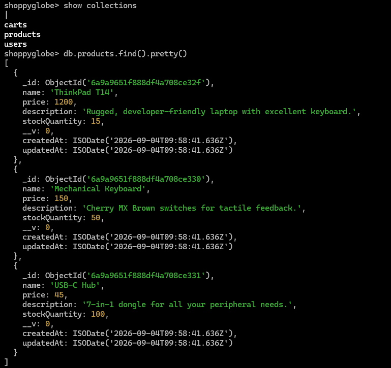

**2. Users and Carts Collections**
Displays the securely hashed passwords in the users collection, alongside the schema structure linking the cart items arrays directly to their respective user IDs.
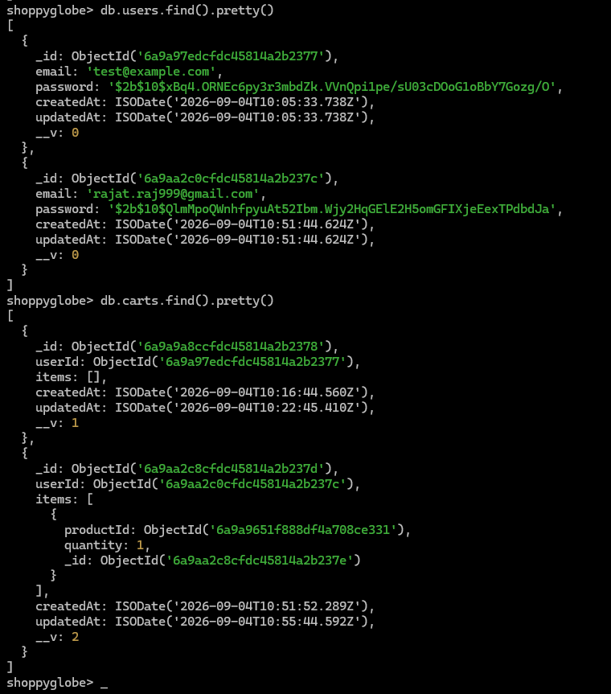

---

## API Testing Documentation (ThunderClient)

The following documentation acts as comprehensive proof of API functionality. These screenshots verify proper HTTP status codes, payload structures, and JWT-based request authorization across all required endpoints.

### Authentication

**1. User Registration (`POST /register`)**
Creates a new user and hashes their password.
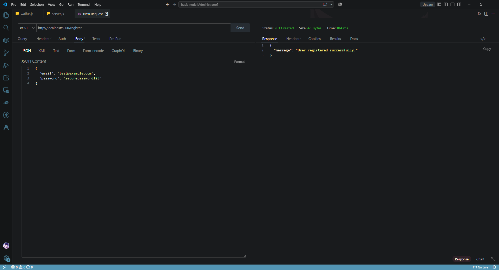

**2. User Login (`POST /login`)**
Authenticates credentials and issues a stateless JSON Web Token.
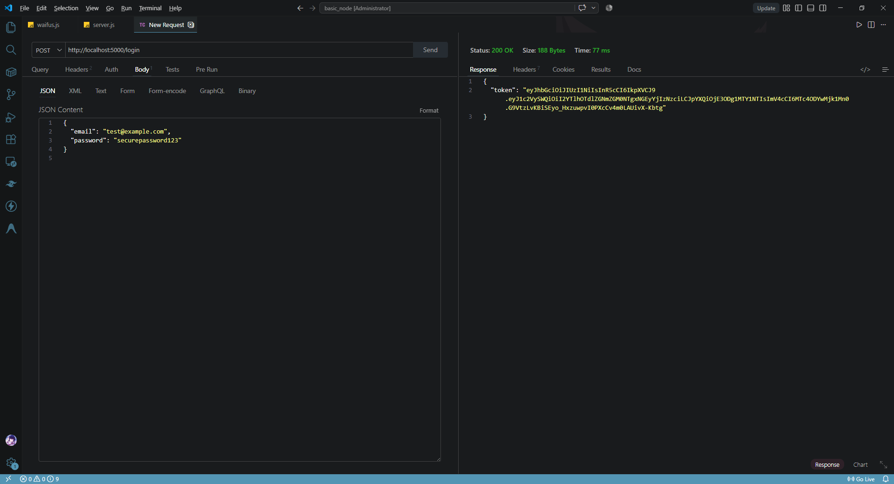

---

### Product Catalog (Public)

**3. Fetch All Products (`GET /products`)**
Retrieves the complete inventory from MongoDB.
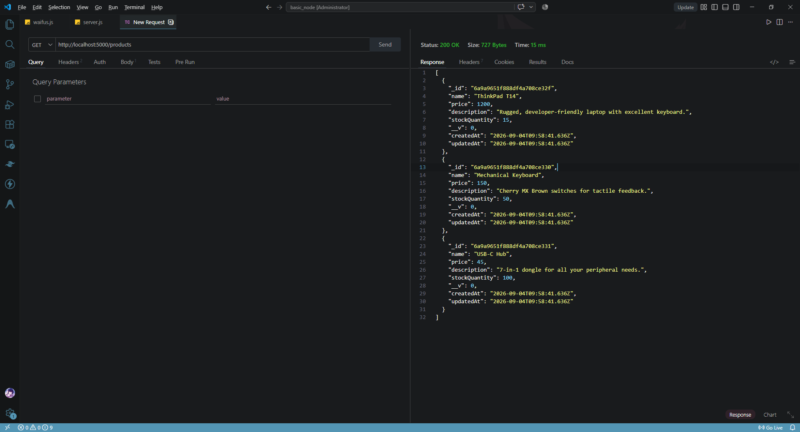

**4. Fetch Single Product (`GET /products/:id`)**
Retrieves details for a specific item using its MongoDB `ObjectId`.
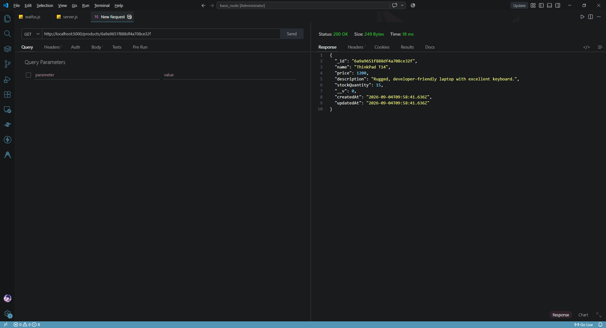

---

### Cart Management (Protected)

*All routes below require a valid JWT passed via the `Authorization: Bearer <token>` header.*

**5. Add to Cart (`POST /cart`)**
Validates the product exists in the DB, then pushes it to the user's cart schema.
*Auth Configuration:*
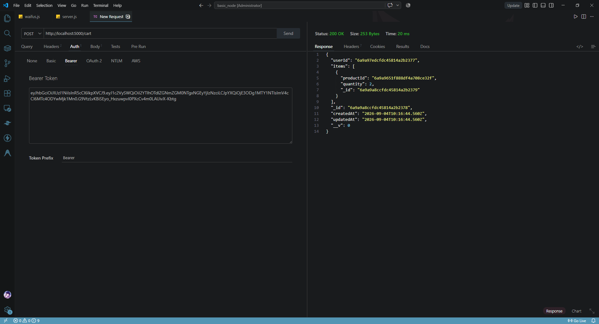
*Request Body & Response:*
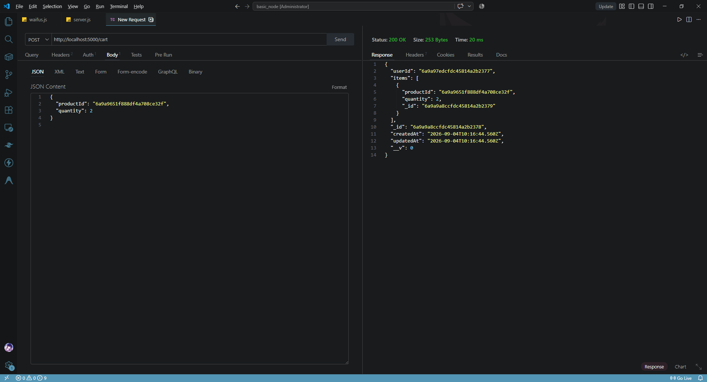

**6. Update Cart Item Quantity (`PUT /cart/:id`)**
Mutates the quantity of a specific item already in the cart.
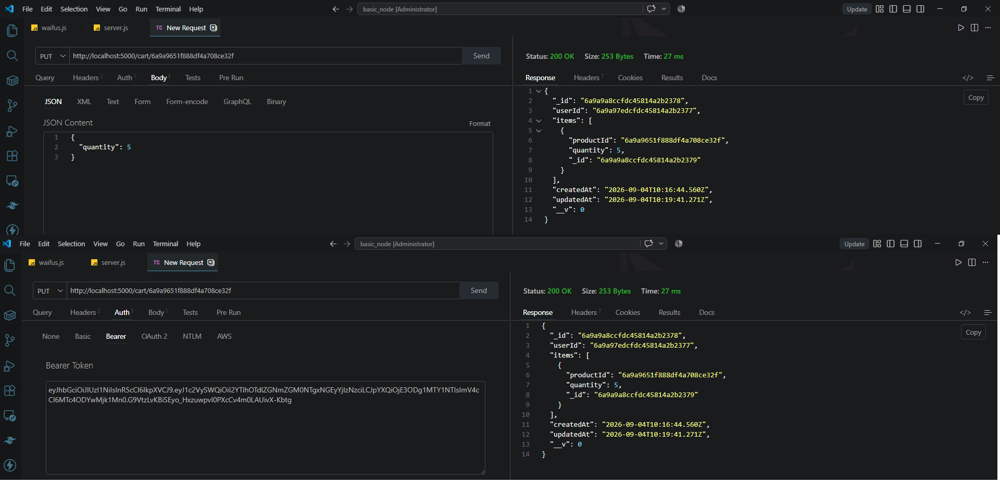

**7. Remove Item from Cart (`DELETE /cart/:id`)**
Filters the item out of the cart's subdocument array entirely.
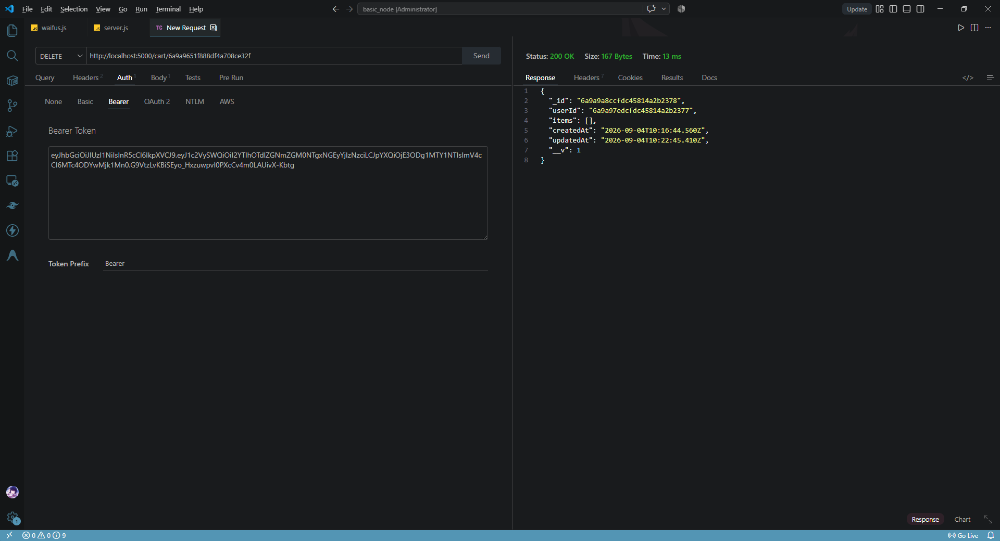

---

### Error Handling & Security

**Access Denied (Missing JWT)**
Verifies that cart routes are strictly protected. Accessing without a valid JWT returns a 401 Unauthorized status.
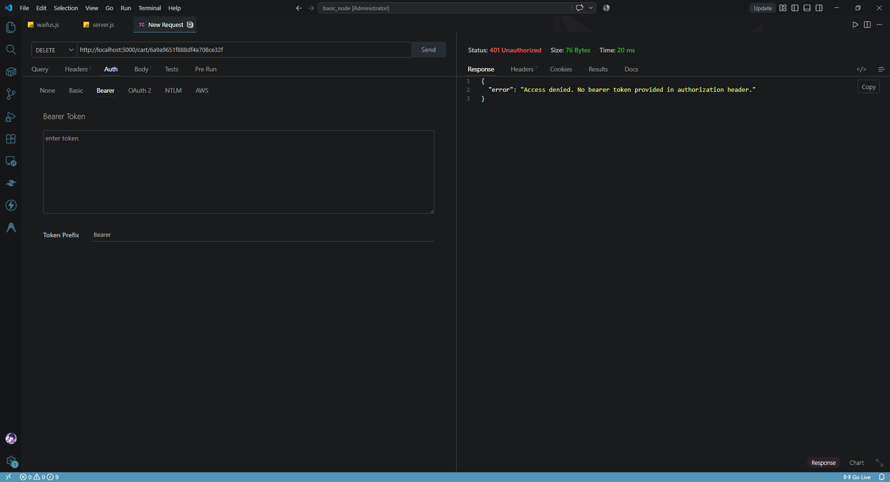

**Validation: Product Not Found**
Validates that input data is rigorously checked. Sending an invalid or non-existent product ID to the cart route correctly throws a 404 Not Found error.
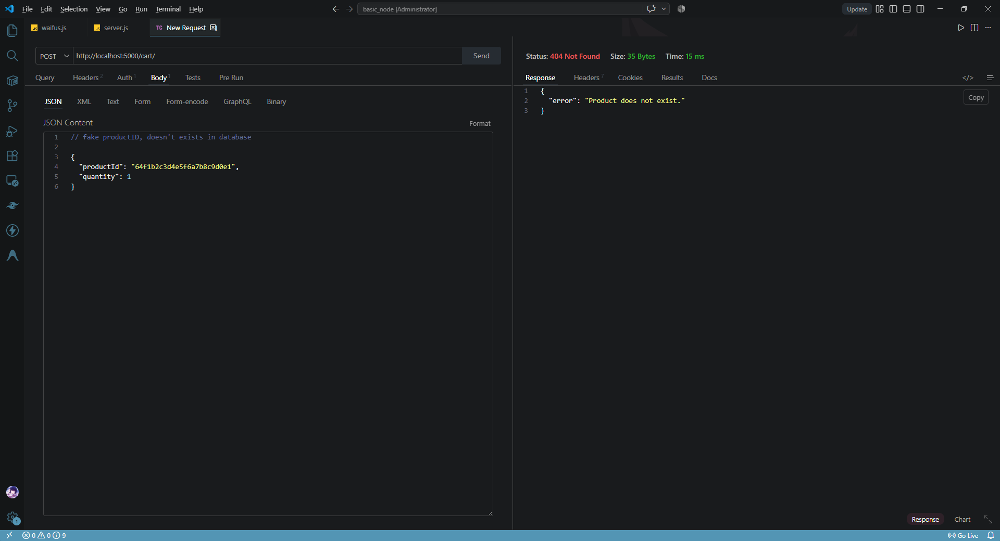
